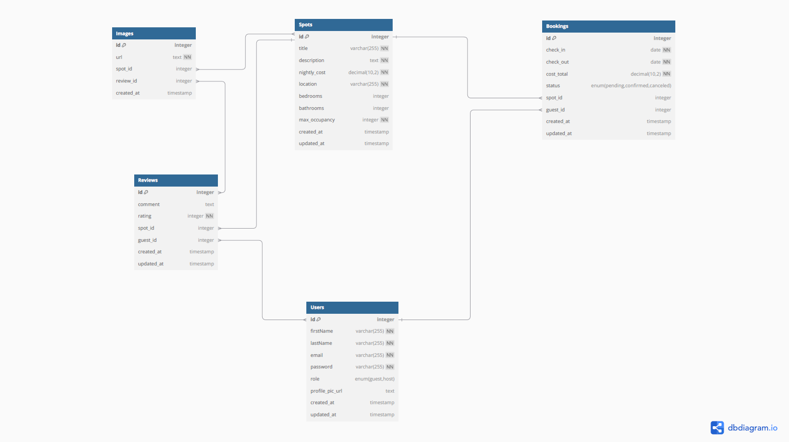

# Housing Finder

Check out a live version of Housing Finder here: https://housing-finder.onrender.com/

Housing Finder is a clone of the website AirBnB. The backend of Housing Finder is built with a PostgreSQL database. Frontend rendering is handled with React.

# Features

When logged in users can create a spot for others to see along with reviews and images for the spot. Users can update or delete any spot that created and also update and delete any reviews they left for other spots.

# React Components

This application has components that include:
- Spots
- SpotDetails
- ManageUserSpots
- CreateSpot
- DeleteSpotModal
- CreateReviewModal
- DeleteReviewModal
- ManageUserReviews
- UpdateReviewModal
- ProfileButton
- Navigation
- LoginFormModal
- SignupFormModal 

# Database Schema

# Summary

On this website you can create a spot for others to see and amanage multiple details about the spot. You can create reviews for different user spots and update or delete these reviews. You can add images to your spot for others to see.

# Screenshots

Home page

Signup

Spot Details

Reviews

## How to clone

`git clone https://github.com/AverytKyle/housing-finder.git`

## How to install and run

Once the repo is cloned, run `cd housing-finder && npm install` to install
dependencies. You will probably also want to run `git init`.

To run the app, type `npm run dev` in the root directory.

# To do

Add functionality to book a reservation